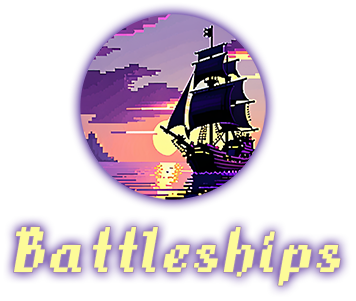
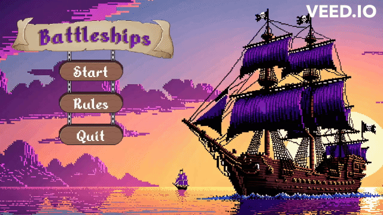
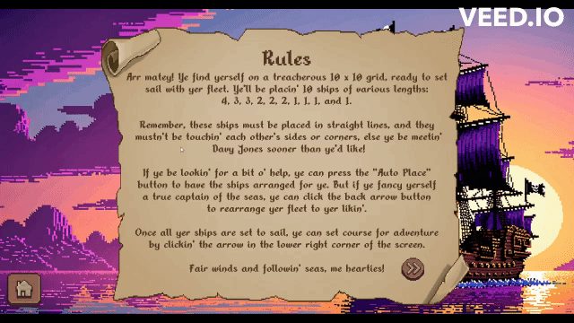
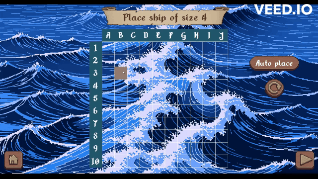
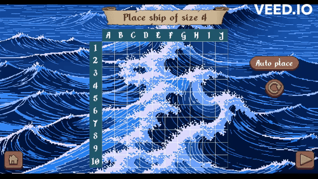
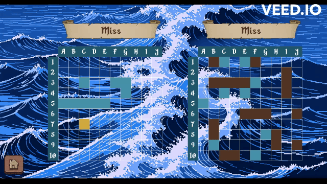

<div align="center">
  

### Classic naval board game implemented in Python using Pygame. Features a game mode against smart computer enemy and GUI in a pixel art-inspired style. I hope you'll enjoy 💜

</div>

# Installation
1. Clone the Repository
   
    ```bash
   git clone https://github.com/AgnikAm/Battleships.git
    ```
3. Set Up Virtual Environment (Optional but Recommended)
   
    ```bash
   # Create a virtual environment named 'venv'
    python -m venv venv

    # Activate the virtual environment (Windows)
    venv\Scripts\activate

    # Activate the virtual environment (macOS/Linux)
    source venv/bin/activate
    ```
5. Install Dependencies
   
    ```bash
   pip install -r requirements.txt
    ```
7. Run the game
   
   ```bash
   cd src
   python app.py
    ```
# Structure
### Division of Responsibilities:
Game logic:

* ship.py - Contains class "Ship" that represents a single ship within game.
It contains attributes such as: length, direction, the segments that make it up, as well as information about whether it has already been placed on the board or sunk.

* gameboard.py - Contains class "Gameboard". It provides functionalities for placing ships, performing attacks, tracking hits and misses. Stores information about the board's owner's score.

Graphical Interface:

* menu.py - visual representation of main menu
* rules.py - visual representation of rules screen
* placement.py - visual representation of screen in which player places ships on the board
* game.py - visual representation of game screen
* end.py - visual representation of game over screen
* grid.py - visual representation of game board

Integration:
* app.py - serves as the main entry point for the Battleship game application. Orchestrates the interaction between various components of the game and manages the game's execution flow.

Additional modules:
* component.py - module that encapsulates Pygame's Rect and Surface to simplify drawing.
* drawing.py - module that stores assets and colors as constants. Also includes two drawing functions.

# Visuals
<div align="center">
  
Main menu:

  

Rules screen:

  

Manual placement:

  

Auto place:

  

Game screen:

  

</div>

# Credits
* [Wooden Pixel Art GUI by Narik](https://soulofkiran.itch.io/pixel-art-wooden-gui-v1)
* [Alkhemikal font by jeti](https://www.dafont.com/alkhemikal.font)
* Pixel art inspired backgrounds generated in Stable Diffusion


